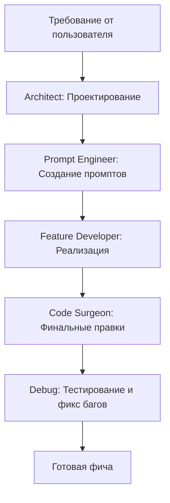
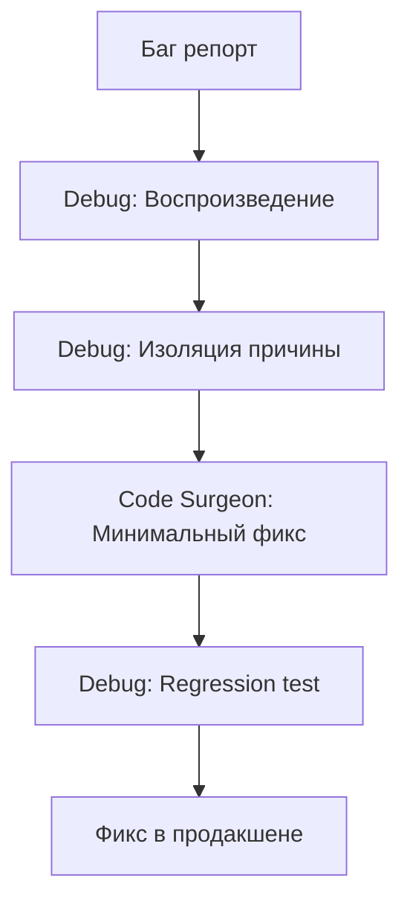
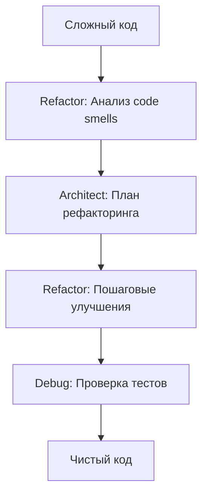

# AI-Driven Development Workflow

## 🎯 Обзор

Этот документ описывает рабочий процесс разработки с использованием AI-ассистентов (Claude, GitHub Copilot, ChatGPT) в проекте **Telegram to PDF Exporter**.

Философия: **"Вайб-кодинг"** — разработка в потоке, где AI берёт на себя рутинные задачи, а разработчик фокусируется на высокоуровневых решениях, архитектуре и бизнес-логике.

## 📁 Структура AI-конфигурации

```
.vscode/
├── settings.json           # Настройки редактора для AI-разработки
├── extensions.json         # Рекомендованные расширения (Copilot, Python)
└── ai/
    ├── architect.md        # Роль: Архитектор (планирование системы)
    ├── prompt-engineer.md  # Роль: Промпт-инженер (оптимизация промптов)
    ├── code-surgeon.md     # Роль: Хирург кода (точечные изменения)
    ├── feature.md          # Роль: Разработчик фич (новая функциональность)
    ├── refactor.md         # Роль: Специалист по рефакторингу
    └── debug.md            # Роль: Отладчик (поиск и исправление багов)
```

## 🤖 Роли AI-ассистентов

### 1. Architect (Архитектор)
**Когда использовать:** Планирование новых крупных фич, изменение архитектуры, выбор паттернов.

**Файл:** `.vscode/ai/architect.md`

**Примеры задач:**
- Проектирование системы экспорта в DOCX/EPUB
- Планирование масштабирования для больших каналов
- Выбор паттернов для новой функциональности
- Рефакторинг архитектуры модулей

**Пример промпта:**
```markdown
Используй роль из .vscode/ai/architect.md

Задача: Спроектировать систему экспорта отчётов в несколько форматов
(PDF, DOCX, HTML, JSON).

Требования:
- Расширяемость (легко добавлять новые форматы)
- Единообразная обработка emoji для всех форматов
- Переиспользование логики форматирования
```

### 2. Prompt Engineer (Промпт-инженер)
**Когда использовать:** Создание промптов для задач, оптимизация существующих промптов.

**Файл:** `.vscode/ai/prompt-engineer.md`

**Примеры задач:**
- Написание промпта для новой фичи
- Улучшение существующего промпта
- Создание шаблонов промптов для команды
- A/B тестирование разных формулировок

**Пример промпта:**
```markdown
Используй роль из .vscode/ai/prompt-engineer.md

Задача: Создать оптимальный промпт для добавления фильтра по ключевым
словам в веб-форму.

Контекст: templates/index.html, web_app.py
Требования: HTML input field, backend validation, integration с existing form
```

### 3. Code Surgeon (Хирург кода)
**Когда использовать:** Точечные изменения в существующем коде, минимальные правки.

**Файл:** `.vscode/ai/code-surgeon.md`

**Примеры задач:**
- Фикс конкретного бага
- Добавление одного параметра в функцию
- Оптимизация узкого места
- Исправление уязвимости

**Пример промпта:**
```markdown
Используй роль из .vscode/ai/code-surgeon.md

Задача: Добавить optional параметр max_posts в функцию fetch_posts
в telegram_parser.py.

Требования:
- НЕ ломать существующие вызовы (backward compatibility)
- Добавить валидацию (max_posts должен быть положительным)
- Обновить docstring
- Написать unit-тест
```

### 4. Feature Developer (Разработчик фич)
**Когда использовать:** Создание новой функциональности с нуля.

**Файл:** `.vscode/ai/feature.md`

**Примеры задач:**
- Новый endpoint в FastAPI
- Новый модуль для экспорта
- Новое поле в веб-форме
- Интеграция с внешним API

**Пример промпта:**
```markdown
Используй роль из .vscode/ai/feature.md

Задача: Добавить фильтрацию постов по ключевым словам.

Требования:
1. Новое поле в веб-форме (templates/index.html)
2. Функция filter_posts_by_keywords в telegram_parser.py
3. Интеграция с generate_pdf_endpoint в web_app.py
4. Unit-тесты и integration-тесты
5. Обновление документации
```

### 5. Refactoring Specialist (Специалист по рефакторингу)
**Когда использовать:** Улучшение структуры существующего кода.

**Файл:** `.vscode/ai/refactor.md`

**Примеры задач:**
- Извлечение повторяющегося кода
- Упрощение сложных условий
- Разделение большого класса/функции
- Замена magic numbers на константы

**Пример промпта:**
```markdown
Используй роль из .vscode/ai/refactor.md

Задача: Рефакторинг pdf_builder.py - выделить генерацию CSS в отдельную
функцию, форматирование постов в отдельный метод.

Требования:
- Сохранить всю функциональность (тесты должны проходить)
- Улучшить читаемость
- Применить Extract Method refactoring
- Маленькие коммиты на каждый шаг
```

### 6. Debugging Specialist (Отладчик)
**Когда использовать:** Поиск и исправление багов, проблемы в продакшене.

**Файл:** `.vscode/ai/debug.md`

**Примеры задач:**
- Воспроизведение и фикс бага
- Анализ traceback
- Создание минимального failing test
- Диагностика производительности

**Пример промпта:**
```markdown
Используй роль из .vscode/ai/debug.md

Проблема: В продакшене отображается "Демо-режим", хотя ENV=production.

Окружение:
- Python 3.11
- ENV=production
- DEMO_MODE не задан в .env

Ожидание: Демо-режим должен быть отключён
Реальность: Синяя плашка "Демо-режим" отображается

Traceback: [если есть]
```

## 🔄 Типичные рабочие процессы

### Workflow 1: Добавление новой фичи



**Пример:**

1. **Architect:** "Спроектируй систему фильтрации постов по ключевым словам"
2. **Prompt Engineer:** "Создай промпты для реализации каждого компонента"
3. **Feature Developer:** "Реализуй фильтрацию в telegram_parser.py и веб-форму"
4. **Code Surgeon:** "Добавь валидацию параметра keywords в web_app.py"
5. **Debug:** "Проверь работу с edge cases (пустые keywords, unicode)"

### Workflow 2: Исправление бага



**Пример:**

1. **Debug:** "Воспроизведи баг с emoji артефактами"
2. **Debug:** "Найди root cause (variation selectors)"
3. **Code Surgeon:** "Добавь нормализацию только в нужных местах"
4. **Debug:** "Напиши regression test для emoji"

### Workflow 3: Рефакторинг legacy кода



**Пример:**

1. **Refactor:** "Проанализируй pdf_builder.py на code smells"
2. **Architect:** "Предложи план: Extract Class PDFBuilder, Extract Method для CSS"
3. **Refactor:** "Применяй рефакторинги по одному с коммитами"
4. **Debug:** "Проверь, что все тесты проходят после каждого шага"

## 📝 Best Practices промптинга

### 1. Всегда указывай роль

```markdown
✅ ХОРОШО:
Используй роль из .vscode/ai/feature.md

Задача: Добавить экспорт в DOCX

❌ ПЛОХО:
Добавь экспорт в DOCX
```

### 2. Предоставляй контекст

```markdown
✅ ХОРОШО:
Проект: Telegram to PDF Exporter
Файл: web_app.py, функция generate_pdf_endpoint()
Стек: FastAPI 0.115.0, python-multipart

❌ ПЛОХО:
В веб-приложении
```

### 3. Будь конкретен

```markdown
✅ ХОРОШО:
Требования:
1. Добавить input field "keywords" (textarea)
2. Backend: split по запятым, trim пробелы
3. Фильтрация: case-insensitive
4. Минимум 5 unit-тестов

❌ ПЛОХО:
Добавь фильтрацию по словам
```

### 4. Указывай ограничения

```markdown
✅ ХОРОШО:
Ограничения:
- НЕ изменять config.py
- НЕ трогать существующие тесты
- Использовать существующий normalize_emoji_text()
- Следовать PEP 8, line length 100

❌ ПЛОХО:
Сделай как считаешь нужным
```

### 5. Предоставляй примеры

```markdown
✅ ХОРОШО:
Пример существующего кода:
```python
def format_reactions(reactions):
    return ", ".join([f"{r['emoji']} {r['count']}" for r in reactions])
```

Сделай аналогично для keywords.

❌ ПЛОХО:
Напиши функцию для форматирования
```

## 🛠️ Интеграция с VS Code

### Настройка GitHub Copilot

1. **Установка:**
   ```bash
   code --install-extension github.copilot
   code --install-extension github.copilot-chat
   ```

2. **Использование в коде:**
   ```python
   # Copilot автоматически подсказывает код на основе комментариев

   # TODO: Normalize emoji text for PDF rendering
   def normalize_emoji_text(text):
       # Copilot предложит реализацию
       ...
   ```

3. **Copilot Chat:**
   - `Cmd+I` (Mac) / `Ctrl+I` (Windows) — инлайн-чат
   - Спроси: "Используя .vscode/ai/feature.md, добавь фильтрацию по keywords"

### Настройка Claude Code (CLI)

1. **Установка:**
   ```bash
   npm install -g @anthropics/claude-code
   ```

2. **Использование:**
   ```bash
   # В корне проекта
   claude-code "Используя .vscode/ai/debug.md, найди и исправь проблему с демо-режимом в продакшене"
   ```

3. **Интеграция с VS Code:**
   - Открой Command Palette (`Cmd+Shift+P`)
   - "Claude Code: Ask"
   - Вставь промпт с ролью

### Быстрые команды (snippets)

Добавь в `.vscode/snippets.code-snippets`:

```json
{
  "AI Architect Prompt": {
    "prefix": "ai-architect",
    "body": [
      "Используй роль из .vscode/ai/architect.md",
      "",
      "Задача: ${1:описание задачи}",
      "",
      "Требования:",
      "- ${2:требование 1}",
      "- ${3:требование 2}"
    ]
  },
  "AI Feature Prompt": {
    "prefix": "ai-feature",
    "body": [
      "Используй роль из .vscode/ai/feature.md",
      "",
      "Задача: ${1:название фичи}",
      "",
      "Контекст:",
      "Файл: ${2:путь к файлу}",
      "",
      "Требования:",
      "1. ${3:требование 1}",
      "2. ${4:требование 2}",
      "",
      "Ограничения:",
      "- НЕ изменять ${5:что не трогать}"
    ]
  },
  "AI Debug Prompt": {
    "prefix": "ai-debug",
    "body": [
      "Используй роль из .vscode/ai/debug.md",
      "",
      "Проблема: ${1:описание проблемы}",
      "",
      "Окружение:",
      "- Python ${2:версия}",
      "- ENV=${3:environment}",
      "",
      "Шаги воспроизведения:",
      "1. ${4:шаг 1}",
      "2. ${5:шаг 2}",
      "",
      "Ожидание: ${6:что должно быть}",
      "Реальность: ${7:что происходит}"
    ]
  }
}
```

**Использование:**
1. Начни печатать `ai-architect` → Tab
2. Заполни плейсхолдеры
3. Скопируй промпт в Claude/Copilot Chat

## 📊 Метрики эффективности AI-разработки

### Как измерять успешность AI-workflow:

1. **Скорость разработки:**
   - Время на реализацию фичи (до/после AI)
   - Количество итераций до рабочего кода

2. **Качество кода:**
   - Code coverage (должен оставаться высоким)
   - Количество багов в новом коде
   - Code review feedback

3. **Эффективность промптов:**
   - Процент промптов, давших рабочий код с первого раза
   - Среднее количество уточнений на промпт

### Пример метрик для проекта:

| Задача | Без AI | С AI | Улучшение |
|--------|--------|------|-----------|
| Добавление DOCX экспорта | 4 часа | 1 час | 4x |
| Фикс emoji бага | 2 часа | 30 мин | 4x |
| Рефакторинг pdf_builder | 3 часа | 45 мин | 4x |
| Написание тестов | 1 час | 15 мин | 4x |

## 🎓 Примеры промптов для проекта

### Пример 1: Добавление нового формата экспорта

```markdown
Используй роль из .vscode/ai/architect.md и затем .vscode/ai/feature.md

## Задача
Добавить экспорт Telegram постов в формат DOCX (Microsoft Word).

## Контекст
Проект: Telegram to PDF Exporter
Существующий код: pdf_builder.py реализует экспорт в PDF через WeasyPrint
Технологии: python-docx (нужно добавить в requirements.txt)

## Требования (Architect)
1. Спроектировать архитектуру с использованием Strategy Pattern
2. Создать ExportStrategy interface
3. Реализовать PDFExportStrategy (рефакторинг существующего кода)
4. Реализовать DOCXExportStrategy (новый класс)
5. Обеспечить единообразную обработку emoji для обоих форматов

## Требования (Feature Developer)
1. Создать модуль docx_builder.py с функцией build_docx()
2. Добавить выбор формата в templates/index.html
3. Обновить web_app.py endpoint /generate для поддержки format parameter
4. Написать unit-тесты для build_docx()
5. Написать integration test для E2E flow

## Ограничения
- НЕ ломать существующую функциональность PDF
- Использовать существующий emoji_handler.normalize_emoji_text()
- Следовать стилю проекта (PEP 8, docstrings)
- Добавить python-docx==1.1.0 в requirements.txt

## Пример использования
```python
from docx_builder import build_docx

build_docx(
    channel_name="Test Channel",
    posts=[...],
    output_path="report.docx",
    date_from="2024-01-01",
    date_to="2024-01-31"
)
```

## Ожидаемый результат
1. Архитектурный план (от Architect)
2. Реализованный код (от Feature Developer)
3. Тесты (5+ unit tests, 1 integration test)
4. Обновлённая документация
```

### Пример 2: Отладка проблемы

```markdown
Используй роль из .vscode/ai/debug.md

## Проблема
На продакшен-домене отображается синяя плашка "Демо-режим: Приложение
работает с тестовыми данными", хотя окружение настроено как production.

## Окружение
- Python: 3.11.5
- OS: Ubuntu 22.04
- ENV: production (проверено через `echo $ENV`)
- DEMO_MODE: не задана в .env
- Файлы: config.py, web_app.py, templates/index.html

## Шаги воспроизведения
1. Зайти на production URL
2. Открыть главную страницу
3. Увидеть синюю плашку с текстом "Демо-режим"

## Ожидаемое поведение
В продакшене (ENV=production) демо-плашка НЕ должна отображаться.
DEMO_MODE должен быть False автоматически.

## Реальное поведение
Плашка отображается, поле "Канал" заблокировано, используются тестовые данные.

## Логи
```
✅ Загружены переменные окружения из .env
🔧 Development режим: DEMO_MODE = True
```

## Что уже попробовано
- Проверил .env файл - ENV=production присутствует
- Перезапустил uvicorn - не помогло
- Проверил config.py - логика выглядит корректно

## Задача
1. Воспроизведи проблему локально
2. Найди root cause (почему DEMO_MODE=True в production)
3. Предложи фикс
4. Добавь валидацию, чтобы это не повторилось
5. Напиши regression test
```

### Пример 3: Рефакторинг

```markdown
Используй роль из .vscode/ai/refactor.md

## Задача
Рефакторинг pdf_builder.py: слишком большая функция build_pdf (150+ строк),
смешаны ответственности (генерация HTML, CSS, форматирование данных,
запись PDF).

## Текущее состояние
Файл: pdf_builder.py
Функция: build_pdf() - 156 строк
Проблемы:
- Генерация CSS захардкожена в функции
- HTML строится через конкатенацию строк
- Форматирование постов смешано с построением HTML
- Сложно тестировать отдельные части

## Цель рефакторинга
1. Выделить генерацию CSS в отдельную функцию get_pdf_css()
2. Выделить форматирование одного поста в _format_post_html()
3. Выделить построение HTML структуры в _build_html_structure()
4. Основная функция build_pdf() должна быть < 30 строк

## Ограничения
- СОХРАНИТЬ всю функциональность (тесты должны проходить)
- НЕ менять публичный API (сигнатура build_pdf остаётся той же)
- Маленькие коммиты: каждый Extract Method = отдельный коммит
- Следовать существующему стилю

## План рефакторинга (пошагово)
1. Extract Method: get_pdf_css() для CSS генерации
2. Extract Method: _format_post_html(post) для форматирования поста
3. Extract Method: _build_html_structure(channel, posts_html)
4. Refactor: использовать все новые методы в build_pdf()
5. Запустить тесты после каждого шага

## Тестирование
После каждого шага запускать:
```bash
pytest test_pdf_builder.py -v
```

Все тесты должны оставаться зелёными.

## Ожидаемый результат
- build_pdf() < 30 строк
- Каждая вспомогательная функция < 20 строк
- Улучшена читаемость
- Сохранена функциональность (все тесты проходят)
- 4-5 коммитов с понятными сообщениями
```

## 🔗 Полезные ссылки

### Документация AI-инструментов:
- [Claude API](https://docs.anthropic.com/)
- [GitHub Copilot Docs](https://docs.github.com/en/copilot)
- [OpenAI API](https://platform.openai.com/docs/)

### Ресурсы по промпт-инженерингу:
- [Anthropic Prompt Engineering Guide](https://docs.anthropic.com/claude/docs/prompt-engineering)
- [OpenAI Best Practices](https://platform.openai.com/docs/guides/prompt-engineering)

### Рефакторинг и паттерны:
- [Refactoring Catalog](https://refactoring.guru/refactoring/catalog)
- [Design Patterns](https://refactoring.guru/design-patterns)

## 💡 Советы и трюки

### 1. Используй роли последовательно
```
Architect → Prompt Engineer → Feature Developer → Code Surgeon → Debug
```

### 2. Сохраняй успешные промпты
Создай файл `.vscode/ai/prompts-library.md` с коллекцией промптов, которые дали отличные результаты.

### 3. Итерируй промпты
Если результат не удовлетворяет, используй Prompt Engineer роль для улучшения промпта.

### 4. Комбинируй роли
```markdown
Используй роли из .vscode/ai/architect.md и .vscode/ai/feature.md

Сначала спроектируй архитектуру (Architect), затем реализуй (Feature Developer).
```

### 5. Версионируй AI-конфигурацию
Коммить изменения в `.vscode/ai/*.md` вместе с кодом для синхронизации в команде.

---

**Итог:** AI — это мощный инструмент, но требует правильной настройки и организации workflow. Используй роли, пиши чёткие промпты, итерируй, и ты увидишь 4x прирост производительности.

**Обратная связь:** Если нашёл полезные приёмы или улучшения workflow — добавляй их в этот документ!
